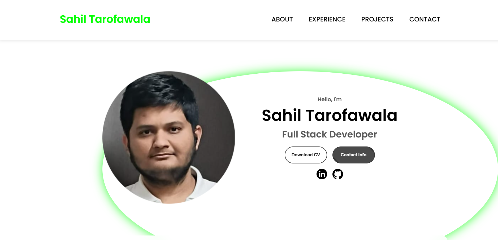

# Sahil Tarofawala - Portfolio

Welcome to my portfolio website! This project is a modern, responsive, and interactive showcase of my skills, experience, and projects as a Full Stack Developer. It features a clean design, smooth animations, and dynamic effects to provide an engaging user experience.

## 🚀 Features
- **Interactive Profile Section**: A glowing, animated profile picture that responds to user interaction.
- **Dynamic Background**: A starry sky effect with randomly moving green dots, creating a futuristic vibe.
- **Responsive Design**: Fully optimized for all screen sizes and devices, ensuring a seamless experience.
- **Smooth Animations**: Scroll-triggered animations and hover effects for a polished user experience.
- **Hamburger Menu**: A mobile-friendly navigation menu with smooth animations.

## 🛠️ Technologies Used
- **HTML5**: For structuring the website.
- **CSS3**: For styling and animations.
- **JavaScript**: For interactivity and dynamic effects.
- **Font Awesome**: For icons.
- **Google Fonts**: For typography.

## 🌟 Live Demo
Check out the live demo of this project: [Live Demo](https://sahil-programmer.github.io/my-portfolio)

## 📸 Screenshots


## 🧑‍💻 How to Run Locally
1. Clone the repository:
   ```bash
   git clone https://github.com/sahil-programmer/my-portfolio.git
